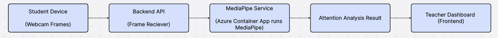

# 🧠 Project Plan

## ✅ Overview

This document outlines the technical execution plan for our attention-monitoring system targeting online classrooms. The core model used is **MediaPipe**, and the architecture leverages **Azure cloud services**.

---

## 🔄 System Process Flow

---

## 📦 Model Selection

- **Chosen Model**: [MediaPipe](https://github.com/google/mediapipe)
- **Developed By**: Google
- **License**: Open-source
- **Purpose**: Real-time face and attention analysis (e.g., head pose, eye tracking)

---

## 🧰 Model Deployment Decision

| Aspect            | Decision                                                  |
|-------------------|-----------------------------------------------------------|
| Deployment Target | **Cloud (Azure)**                                         |
| Reasoning         | Offloading processing from students’ devices for better performance and reduced client-side requirements |
| Client Side       | **No MediaPipe execution on client side**                |

---

## 🖥️ System Architecture

- **Frontend**: Stays as originally planned (student and teacher interfaces)
- **Backend**: Also remains unchanged; handles frame reception, processing, and communication with AI model
- **MediaPipe**: Deployed as a containerized microservice in the cloud (Azure Container Apps)

---

## 🧩 Azure Services

- **TBD**

---

## 📝 Notes

- No changes to the frontend/backend logic were required during this phase.
- Deployment of MediaPipe to the cloud provides better scalability and device-agnostic behavior.
- Client devices (students) only send frames — no heavy processing happens locally.

